<div align="center">


### Software-defined TETRA base station (fork), built in Rust for Raspberry Pi.

[](LICENSE)
[](https://www.rust-lang.org)
[](https://github.com/Aitorrio/bost-flowstation/tree/bost)

</div>

---

## What is Bost FlowStation?

**Bost FlowStation** is a fork of [FlowStation](https://github.com/razvanzeces/flowstation) focused on **easy Raspberry Pi installs** and **day-to-day operation from the web dashboard** — without living in SSH and `config.toml`.

Based on FlowStation by **Razvan Zeces / YO6RZV** (itself built on [tetra-bluestation](https://github.com/MidnightBlueLabs/tetra-bluestation)). Improved by **Aitor, EA4HBL**.

**Tested hardware:** LimeSDR Mini 2.0 · SXceiver · Motorola MXP600 · Motorola MTM800E · Motorola MTM5400

> Protocol details, Brew theory, Asterisk/DAPNET/GeoAlarm and upstream bug history live in the [original FlowStation README](https://github.com/razvanzeces/flowstation/blob/main/README.md). This page documents **what this fork adds** and **how to run it**.

---

## What’s new in this fork

| Capability | Why it matters |
|---|---|
| One-command Pi install | Boots with RF off so the dashboard is always reachable |
| First-run **Setup** wizard | Install SDR drivers and finish RF / net / Brew from the browser |
| Visual **Config** (Cell × Brew profiles) | Switch networks without hand-editing TOML |
| Access control & U-STATUS remote control in GUI | Whitelist + walkie commands (`ip` / `temp` / `info` / `restart`…) without SSH |
| **System** control panel | Restart, suspend, full power-off, **OTA**, and **panel account** from the dashboard |
| Sidebar update badge | Glance notice when a newer `bost` commit is available |
| Spanish-first UI (multi-language) | Ready for operators who prefer ES |

---

## Installation

On **Raspberry Pi OS / Debian arm64**:

```bash
curl -fsSL https://raw.githubusercontent.com/Aitorrio/bost-flowstation/bost/contrib/install/install-bost.sh | sudo bash
```

When it finishes you should see something like:

<p align="center">
  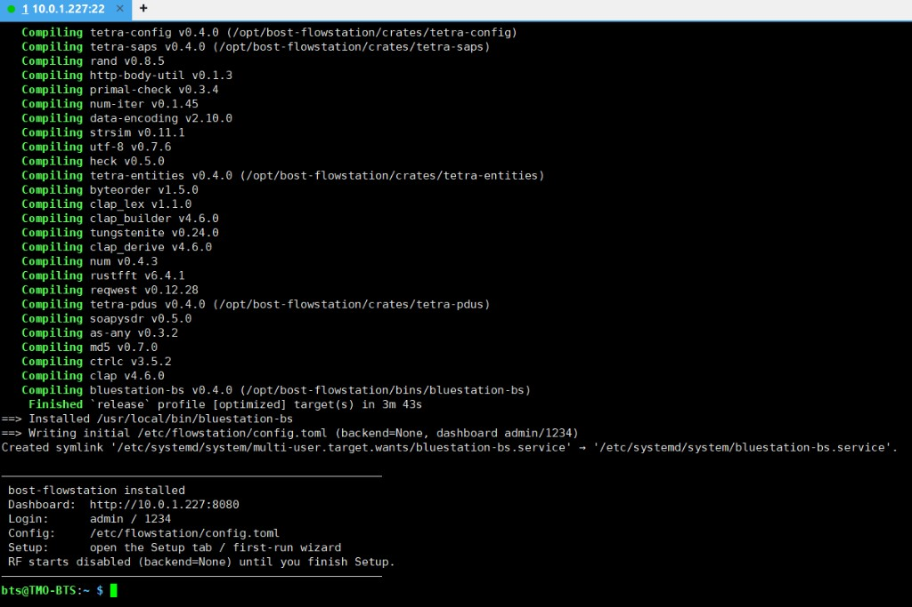
</p>

| | |
|---|---|
| Dashboard | `http://<pi-ip>:8080` |
| Default login | `admin` / `1234` |
| Config on disk | `/etc/flowstation/config.toml` (+ `.fallback` reserve) |
| Sources | `/opt/bost-flowstation` (branch `bost`) |

More detail (env vars, force-clean, helper script): [`Docs/install-and-setup.md`](Docs/install-and-setup.md).

---

## First login & Setup wizard

1. Open the dashboard URL printed by the installer.
2. Sign in with `admin` / `1234` (change them later under **System → Account**).

<p align="center">
  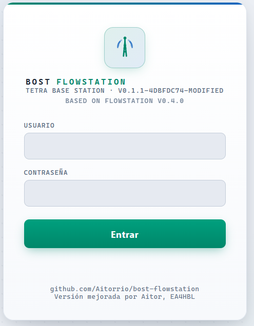
</p>

3. If setup is incomplete, the **Setup** wizard opens automatically (also available from the sidebar).
4. In **Select SDR**, scan hardware or install the **SXceiver** / **Lime** driver, then continue through RF, network and Brew. Enable RF and restart when ready.

<p align="center">
  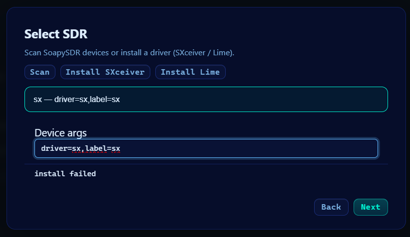
</p>

The stack starts with `phy_io.backend = "None"` so the web UI works even before an SDR is ready.

---

## Configure from the web UI

Open **Config** in the sidebar. Prefer the visual forms over raw TOML — that is the point of this fork.

### TMO profiles (Cell × Brew)

1. Pick a **TMO Cell** and a **Core Net (Brew)** (or Offline).
2. **Add / Edit** opens a floating sheet with the full Cell or Brew form (including Auto RX + carrier and MHz normalization). **Save** stores the profile JSON only — it does not restart.
3. **Apply & Restart** puts the selected pair on air from the profiles on disk (edit in a sheet first if you need changes).

<p align="center">
  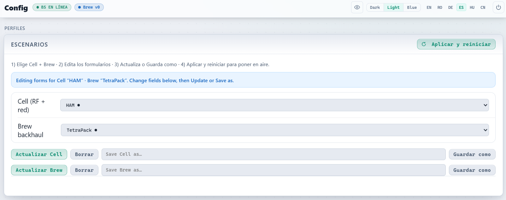
</p>

Use this to jump between networks (e.g. local cell vs BrandMeister) without rewriting `config.toml` by hand.

### Live settings

Expand **Live settings** to edit the running station (RF, network, Brew, ISSI whitelist). Frequencies (TX/RX and custom duplex) are entered in **MHz** (comma or dot). On blur the UI normalizes like Motorola CPS to six decimals (e.g. `432,2` → `432.200000`); the running `config.toml` still stores **Hz**.

**Apply & Restart** writes those forms into `/etc/flowstation/config.toml` only — it does **not** update a Cell/Brew profile JSON.

Under **Hardware RF** (collapsed by default): the SDR **device** string is read-only (set in Setup); PPM, antennas and gain stages follow that driver. Enter numbers with comma or dot; empty gain/antenna fields omit the keys so the device defaults apply. Saving rejects gain stages that do not belong to the selected family (e.g. Lime `pad` on SXceiver).

<p align="center">
  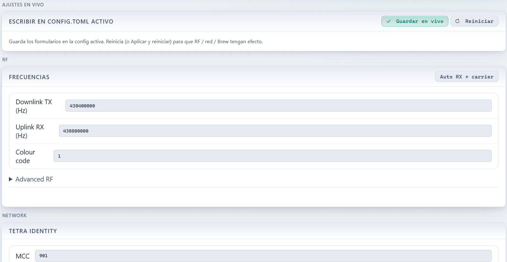
</p>

### Access control (ISSI whitelist)

The ISSI whitelist lives inside the **Cell** form (profile sheet) and inside **Live settings** — not as a separate page section. Empty list = open network; with entries, only listed radios may register.

- In a **profile sheet**, **Save** stores the list on that Cell profile.
- In **Live settings**, **Apply & Restart** writes it to the active config only.
- **Apply & Restart** on Profiles puts the selected Cell on air, including its saved whitelist.

U-STATUS remote control stays station-wide (not stored in Cell/Brew).

<p align="center">
  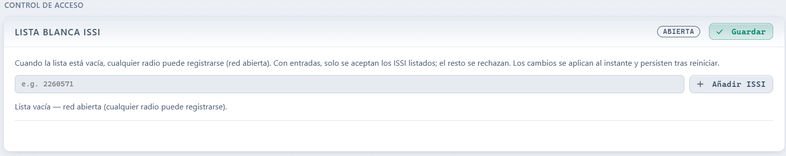
</p>

### Remote control (U-STATUS)

In **Control remoto (U-STATUS)**, authorize radios and map status codes to actions (`ip`, `temp`, `info`, `restart`, `shutdown`, `kick_all`). Configured from the dashboard; not stored inside Cell/Brew profiles.

<p align="center">
  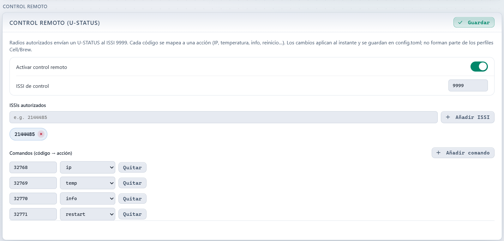
</p>

### Advanced (raw `config.toml`)

Collapsed under **Advanced** for power users: red warning, then **Save** and **Apply & Restart**. Full annotated reference: [`example_config/config.toml`](example_config/config.toml).

<p align="center">
  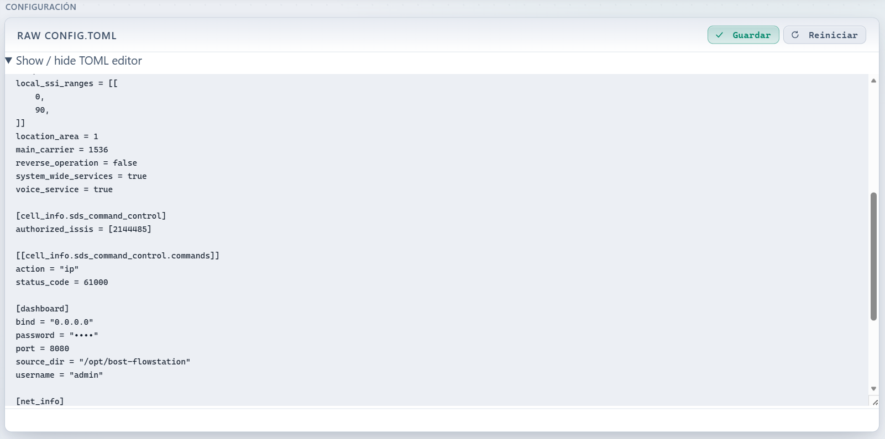
</p>

---

## Stability and system robustness

This fork hardens day-to-day operation so your BTS keeps working — and stays recoverable — in most of the situations that used to mean “reinstall from scratch”.

Robustness around system config files has been improved so the instance can keep running even when things go badly wrong, then get you back to a healthy station from the web UI.

**What protects you in normal use**

- Dashboard writes **validate before they touch disk**, so ordinary Config / Save live / Apply flows should not brick the service.
- Prefer the visual forms over SSH hand-edits of `config.toml`.
- **No SDR / RF off** (`phy_io.backend = "None"` or Soapy failing to open) still starts the dashboard — same path as first-boot Setup — so you can finish drivers and RF from the browser.

**If you do break the live config** (typical after a bad SSH edit)

- Install keeps a sibling reserve: **`/etc/flowstation/config.toml.fallback`** (known-good; **not** overwritten when you save from the GUI).
- If the primary fails to **parse** or **validate** at boot, the service loads `.fallback`, brings the dashboard up, and shows a red warning banner.
- From there you can recover **without reinstalling**: open **Config**, **Apply & Restart** a Cell × Brew profile you already saved — that rewrites a valid primary `config.toml` even if SSH left it unusable — then restart once more if needed.
- Or fix the primary in the visual forms / raw editor / **Restore `.bak`**, then Restart.

Refresh the reserve when you have a config you trust:

```bash
sudo cp /etc/flowstation/config.toml /etc/flowstation/config.toml.fallback
```

**Re-running the installer**

If you ever need to run [`contrib/install/install-bost.sh`](contrib/install/install-bost.sh) again: it is **repair-oriented and non-destructive**. It keeps an existing `/etc/flowstation/config.toml`, creates `.fallback` only when missing (never overwrites your reserve), and refreshes the service/helper pieces without wiping your station identity.

---

## Day-to-day dashboard

<p align="center">
  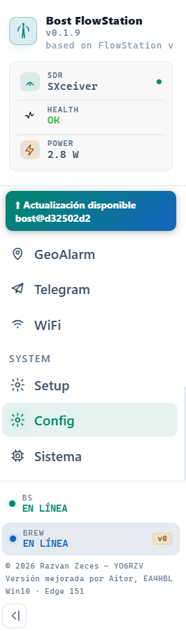
</p>

| Page | Use it for |
|---|---|
| **Radios** | Registered terminals, RSSI, kick / SDS, timeslot view |
| **DGNA** | Assign / deassign talkgroups over the air |
| **Calls / Last Heard / Log** | Live traffic and diagnostics |
| **RF / Health** | Spectrum / constellation and subsystem health |
| **Config** | TMO profiles (sheets), live settings, Cell ISSI whitelist, remote U-STATUS, advanced TOML |
| **System** | Host metrics, service control, OTA, panel account |
| **Setup** | Re-run first-boot helper anytime |

---

## System control & OTA updates

Restart, suspend, full power-off and OTA live in the **System** hero (top-right actions) — not in Config.

<p align="center">
  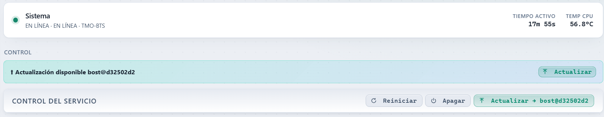
</p>

- **Reiniciar** — soft restart of `bluestation-bs`
- **Suspender** — soft standby: radio stack stops, dashboard stays up; the button becomes **Iniciar** to bring the station back
- **Apagar** — full host shutdown (`systemctl poweroff`); you will likely need to cycle power to boot again
- **Canal OTA** — **Estable** (`bost`, day-to-day) or **Beta** (`beta`, previews); persisted as `[dashboard] ota_channel`
- **Actualizar** — OTA on the selected channel: `git fetch` + `reset --hard` to that branch (keeps `target/` for incremental builds), rebuild only if the running binary is behind, install, restart

When a newer commit is on GitHub for the **active channel**, a banner appears above the System hero and a matching badge shows in the sidebar (click → System).

The OTA dialog shows a progress bar and the current build line (expand **Ver todo** for the full log):

<p align="center">
  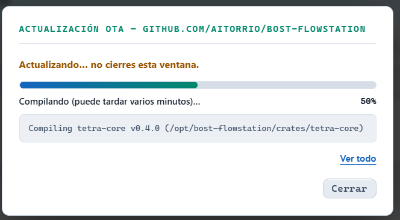
</p>

<p align="center">
  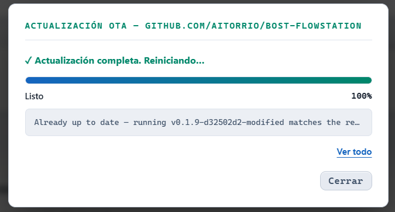
</p>

Compiles on a Pi can take several minutes — leave the window open until it finishes.

### Panel account (login)

Under **System → Account** you manage the single dashboard login (the same `[dashboard]` username/password in `config.toml`) without editing TOML by hand. Station-wide — like U-STATUS, **not** part of Cell/Brew profiles.

<p align="center">
  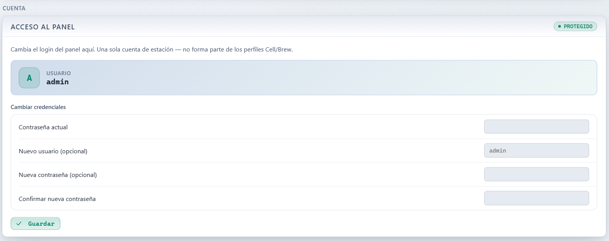
</p>

- Change **username** and/or **password** (current password required).
- If the panel was open (no auth), **enable login** from the same card.
- Changes apply immediately and persist across restart; you are asked to sign in again.

Default after install remains `admin` / `1234` — change it here on first opportunity.

---

## Optional: build from source

Only if you are not using the installer:

```bash
git clone https://github.com/Aitorrio/bost-flowstation.git -b bost
cd bost-flowstation
cp example_config/config.toml ./config.toml
# Prefer phy_io.backend = "None" until RF is configured via Setup / Config
cargo build --release -p bluestation-bs
./target/release/bluestation-bs config.toml
```

---

## Branches

| Branch | Purpose |
|---|---|
| **`bost`** | This fork — install script, Setup, visual config, OTA, Spanish UI |
| `main` | Upstream-aligned mirror — **do not** use for Bost features |
| `alpha` | Upstream active development |

---

## Upstream & community

- **This fork:** [github.com/Aitorrio/bost-flowstation](https://github.com/Aitorrio/bost-flowstation) (branch `bost`)
- **Upstream project:** [FlowStation](https://github.com/razvanzeces/flowstation) · [flowstation.dev](https://flowstation.dev) · [Telegram](https://t.me/+fktnT-th7dcxYWNk)

For Asterisk, DAPNET, Snom, GeoAlarm and deep protocol notes, use the upstream docs — this fork inherits those features but documents the **Pi + dashboard** path here.

---

## Credits

- **Razvan Zeces / YO6RZV** and the FlowStation community for the base station stack
- **Mihajlo YU4MSH**, **Torben DJ2TH**, **Joaquin EA5GVK** and others credited upstream
- **MidnightBlueLabs** — [tetra-bluestation](https://github.com/MidnightBlueLabs/tetra-bluestation)
- **Aitor, EA4HBL** — this fork (install, Setup, visual config, OTA UX, Spanish UI)

---

## License

Apache 2.0 — see [LICENSE](LICENSE)
