<div align="center">


### Software-defined TETRA base station (fork), built in Rust for Raspberry Pi.

[](LICENSE)
[](https://www.rust-lang.org)
[](https://github.com/Aitorrio/bost-flowstation/tree/main)

</div>

> **Coming soon: PTBS (Personal Tetra Base Station)**  
> Bost FlowStation evolves into **PTBS** — open source for radio amateurs and professional/commercial use.  
> **Please run dashboard OTA once** on this bridge release (**v0.3.12+**). Stable tracks git branch **`main`**. Full rebrand (repo name, binary, UI) continues toward **PTBS**.  
> ES: *Pronto PTBS. Haz OTA una vez (v0.3.12+). Estable → rama `main`.*

---

## What is Bost FlowStation?

**Bost FlowStation** is a fork of [FlowStation](https://github.com/razvanzeces/flowstation) focused on **easy Raspberry Pi installs** and **day-to-day operation from the web dashboard** — without living in SSH and `config.toml`.

Based on FlowStation by **Razvan Zeces / YO6RZV** (itself built on [tetra-bluestation](https://github.com/MidnightBlueLabs/tetra-bluestation)). Improved by **Aitor, EA4HBL**.

**Tested hardware:** LimeSDR Mini 2.0 · SXceiver · Motorola MXP600 · Motorola MTM800E · Motorola MTM5400

> Protocol details, Brew theory, Asterisk/DAPNET/GeoAlarm and upstream bug history live in the [original FlowStation README](https://github.com/razvanzeces/flowstation/blob/main/README.md). This page documents **what this fork adds** and **how to run it**.

---

## What’s new in this fork

| Capability | Why it matters |
|---|---|
| One-command Pi install | Boots with RF off so the dashboard is always reachable |
| First-run **Setup** wizard | Install SDR drivers and finish RF / net / Brew from the browser |
| Visual **Config** (Cell × Brew profiles) | Switch networks without hand-editing TOML |
| **LST Dispatch** console | Local group/private voice + SDS from the browser (HTTPS) |
| Access control & U-STATUS remote control in GUI | Whitelist + walkie commands (`ip` / `temp` / `info` / `restart`…) without SSH |
| **System** control panel | Restart, suspend, full power-off, **OTA**, and **panel account** from the dashboard |
| Sidebar update badge | Glance notice when a newer commit is available on the **active OTA channel** |
| Spanish-first UI (multi-language) | Ready for operators who prefer ES |
| **Multi-cell** *(new in v0.5.0)* | One station, several SDRs: each SDR is one more TETRA cell, linked for calls, SDS and handover |
| **Ambience Listening (SS-AL)** *(new in v0.5.4)* | Dispatcher-invoked receive-only call: a supporting radio connects and keys its mic on its own (indicated on the radio, not covert) |
| **Request for Location (LIP)** *(new in v0.5.4)* | Dispatcher asks a radio for its position (once or polled); the LIP report reaches the console that requested it |

---

## Installation

On **Raspberry Pi OS / Debian arm64** (always installs from branch **`main`** / channel Estable unless you override `BOST_BRANCH`):

```bash
curl -fsSL https://raw.githubusercontent.com/Aitorrio/bost-flowstation/main/contrib/install/install-bost.sh | sudo bash
```

When it finishes you should see something like:

<p align="center">
  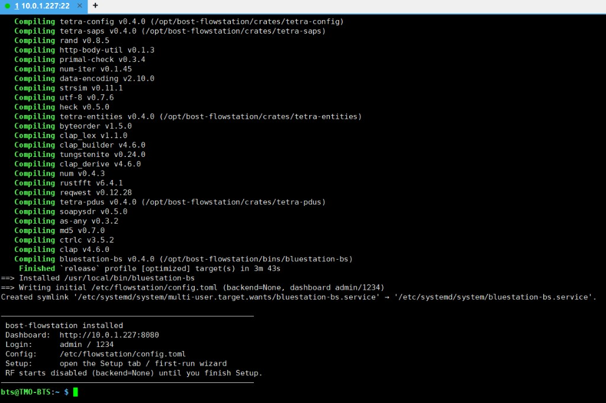
</p>

| | |
|---|---|
| Dashboard | `https://<pi-ip>/` (HTTP `:80` redirects to HTTPS) |
| Default login | `admin` / `1234` |
| Config on disk | `/etc/flowstation/config.toml` (+ `.fallback` reserve) |
| Sources | `/opt/bost-flowstation` (branch `main`) |

More detail (env vars, force-clean, helper script): [`Docs/install-and-setup.md`](Docs/install-and-setup.md).

---

## First login & Setup wizard

1. Open the dashboard URL printed by the installer.
2. Sign in with `admin` / `1234` (change them later under **System → Account**).

<p align="center">
  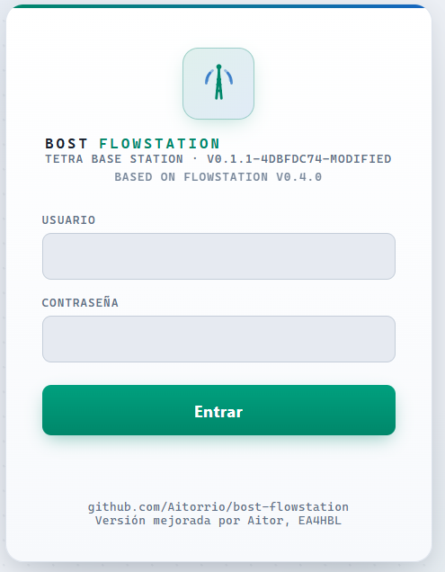
</p>

3. If setup is incomplete, the **Setup** wizard opens automatically (also available from the sidebar).
4. In **Select SDR**, scan hardware or install the **SXceiver** / **Lime** driver, then continue through RF, network and Brew. Enable RF and restart when ready.

<p align="center">
  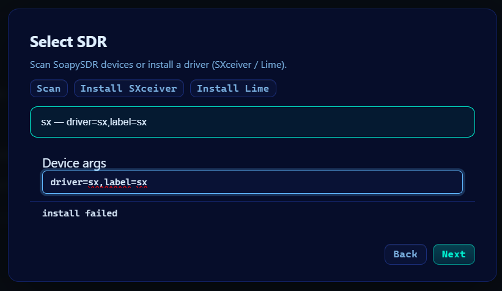
</p>

The stack starts with `phy_io.backend = "None"` so the web UI works even before an SDR is ready.

---

## Configure from the web UI

Open **Config** in the sidebar. Prefer the visual forms over raw TOML — that is the point of this fork.

### TMO profiles (Cell × Brew)

1. Pick a **TMO Cell** and a **Core Net (Brew)** (or Offline).
2. **Add / Edit** opens a floating sheet with the full Cell or Brew form (including Auto RX + carrier and MHz normalization). **Save** stores the profile JSON only — it does not restart.
3. **Apply & Restart** puts the selected pair on air from the profiles on disk (edit in a sheet first if you need changes).

<p align="center">
  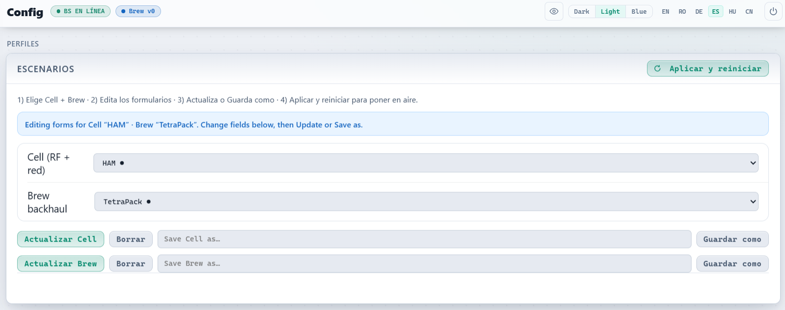
</p>

Use this to jump between networks (e.g. local cell vs BrandMeister) without rewriting `config.toml` by hand.

### Live settings

Expand **Live settings** to edit the running station (RF, network, Brew, ISSI whitelist). Frequencies (TX/RX and custom duplex) are entered in **MHz** (comma or dot). On blur the UI normalizes like Motorola CPS to six decimals (e.g. `432,2` → `432.200000`); the running `config.toml` still stores **Hz**.

**Apply & Restart** writes those forms into `/etc/flowstation/config.toml` only — it does **not** update a Cell/Brew profile JSON.

Under **Hardware RF** (collapsed by default): the SDR **device** string is read-only (set in Setup); PPM, antennas and gain stages follow that driver. Enter numbers with comma or dot; empty gain/antenna fields omit the keys so the device defaults apply. Saving rejects gain stages that do not belong to the selected family (e.g. Lime `pad` on SXceiver).

<p align="center">
  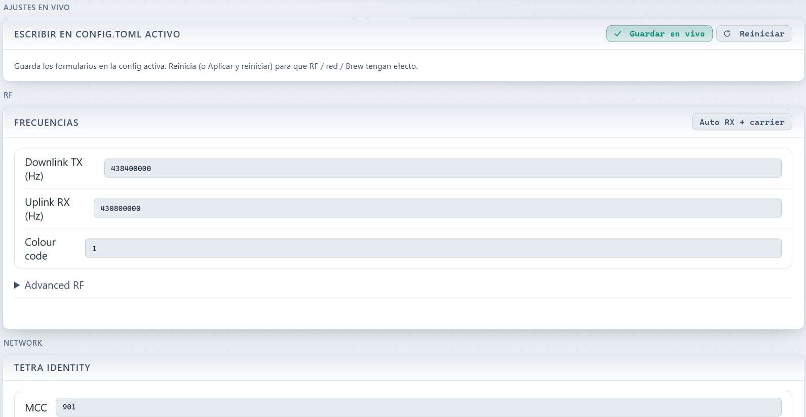
</p>

### Access control (ISSI whitelist)

The ISSI whitelist lives inside the **Cell** form (profile sheet) and inside **Live settings** — not as a separate page section. Empty list = open network; with entries, only listed radios may register.

- In a **profile sheet**, **Save** stores the list on that Cell profile.
- In **Live settings**, **Apply & Restart** writes it to the active config only.
- **Apply & Restart** on Profiles puts the selected Cell on air, including its saved whitelist.

U-STATUS remote control stays station-wide (not stored in Cell/Brew).

<p align="center">
  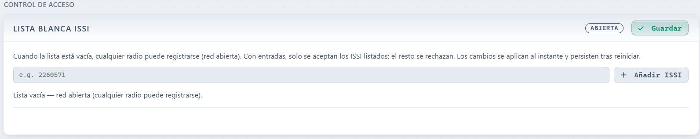
</p>

### Remote control (U-STATUS)

In **Control remoto (U-STATUS)**, authorize radios and map status codes to actions (`ip`, `temp`, `info`, `restart`, `shutdown`, `kick_all`). Configured from the dashboard; not stored inside Cell/Brew profiles.

<p align="center">
  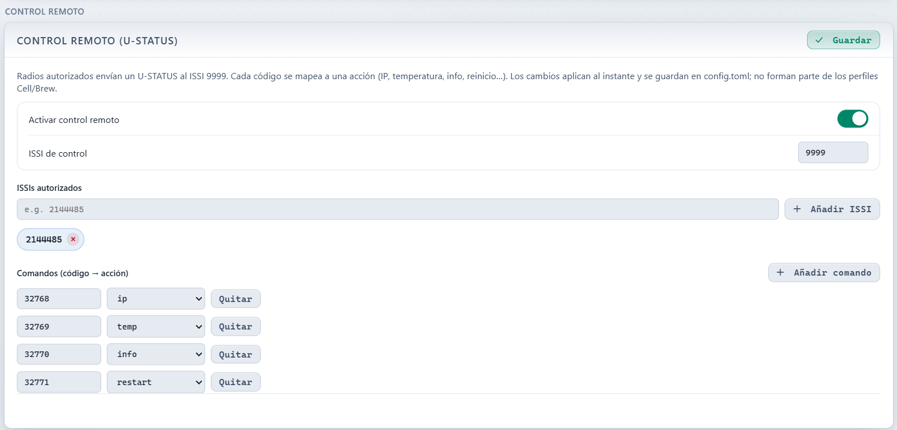
</p>

### Advanced (raw `config.toml`)

Collapsed under **Advanced** for power users: red warning, then **Save** and **Apply & Restart**. Full annotated reference: [`example_config/config.toml`](example_config/config.toml).

<p align="center">
  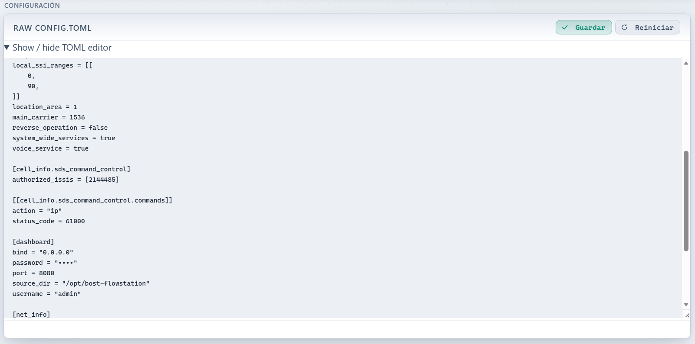
</p>

---

## Multi-cell: one station, several SDRs *(v0.5.0)*

Every extra SDR can run one more TETRA cell from the same station — for example a Pi with two Pluto+ on the network. All cells share one network identity (MCC/MNC), one dashboard and one set of network links, and radios move between them like between sites of one system.

> **Status:** new in **v0.5.0** — complete in code and unit tests, **not yet validated on air**. Please report how it behaves with your radios.

### Setting it up

- **Dashboard:** the Home page **Cells** card lists every cell (RF state, carriers, SDR, radios). *Scan* finds your SDRs; pick the device, a free carrier and optionally a colour code, and *Add cell* — the station restarts. *Remove* takes a cell out again.
- **By hand:** add a `[[cells]]` entry per extra SDR. It inherits everything from `[cell_info]` except what you override:

  ```toml
  [phy_io.soapysdr]
  device = "driver=plutosdr,uri=ip:192.168.2.1"   # the primary cell's SDR (required once there are cells)

  [[cells]]
  id = 1                                          # 1-7

  [cells.cell_info]
  main_carrier = 1525                             # unique per cell
  colour_code = 2

  [cells.soapysdr]
  device = "driver=plutosdr,uri=ip:192.168.3.1"
  tx_freq = 438125000
  rx_freq = 433125000
  ```

  Rules: up to 8 cells (ids 1-7 plus the primary), every carrier unique, same `freq_band` and `custom_duplex_spacing`, and every cell (the primary too) names its own SDR `device`. See the commented example at the end of [`example_config/config.toml`](example_config/config.toml).

### What linking gives you

Cells are **linked** when Brew or LST Dispatch is enabled; without either, each cell runs on its own.

- **Group calls** — from the network or from any radio — reach every cell with members of the group. One talker per group across all cells; an emergency call takes the floor from a normal one.
- **Individual calls and SDS** work between radios on different cells; group SDS reaches members on every cell. Only traffic for nobody on site goes out to Brew, and talkgroups in `local_ssi_ranges` link the cells without ever reaching Brew.
- **Asterisk (SIP)** and **WX/METAR** work from every cell; dashboard WX changes apply to all of them.
- Voice passed between cells is buffered and played out on the receiving cell's own timing (separate SDRs have separate clocks).

### Moving between cells

- Every cell automatically advertises the others as neighbours (no need to list them in `neighbor_cells_ca`), with what radios need to find and rank them, and supporting both unannounced and announced reselection.
- **Unannounced:** a radio that registers on another cell is dropped silently on the old one, and restores its group call on the new one.
- **Announced (D-NEW-CELL):** the new cell joins the radio's group calls before it arrives; a registration the radio forwards in U-PREPARE is processed by the new cell and answered in D-NEW-CELL.
- Reselection thresholds and hysteresis are configurable in `[cell_info.cell_reselect]` (defaults 20/10/10/6 dB).

### Dashboard and telemetry

The registered-radios table shows every cell's radios with a C0/C1… badge, the Calls page includes calls on every cell, and telemetry carries each radio's cell (`MsCell` event).

### Known limits

- The bit layout of the reselection parameters and the neighbour carrier extension follows our reading of EN 300 392-2; check a radio's field-test display if reselection misbehaves.
- A group call spanning cells shows once per cell in the Calls list (each cell runs its own traffic channel).
- Individual calls do not survive a change of cell.
- CPU and USB/network bandwidth for several SDRs on one Pi are untested; start with two cells.

Design notes and per-phase status: [`Docs/multi-cell-plan.md`](Docs/multi-cell-plan.md).

## Stability and system robustness

This fork hardens day-to-day operation so your BTS keeps working — and stays recoverable — in most of the situations that used to mean “reinstall from scratch”.

Robustness around system config files has been improved so the instance can keep running even when things go badly wrong, then get you back to a healthy station from the web UI.

**What protects you in normal use**

- Dashboard writes **validate before they touch disk**, so ordinary Config / Save live / Apply flows should not brick the service.
- Prefer the visual forms over SSH hand-edits of `config.toml`.
- **No SDR / RF off** (`phy_io.backend = "None"` or Soapy failing to open) still starts the dashboard — same path as first-boot Setup — so you can finish drivers and RF from the browser.

**If you do break the live config** (typical after a bad SSH edit)

- Install keeps a sibling reserve: **`/etc/flowstation/config.toml.fallback`** (known-good; **not** overwritten when you save from the GUI).
- If the primary fails to **parse** or **validate** at boot, the service loads `.fallback`, brings the dashboard up, and shows a red warning banner.
- From there you can recover **without reinstalling**: open **Config**, **Apply & Restart** a Cell × Brew profile you already saved — that rewrites a valid primary `config.toml` even if SSH left it unusable — then restart once more if needed.
- Or fix the primary in the visual forms / raw editor / **Restore `.bak`**, then Restart.

Refresh the reserve when you have a config you trust:

```bash
sudo cp /etc/flowstation/config.toml /etc/flowstation/config.toml.fallback
```

**Re-running the installer**

If you ever need to run [`contrib/install/install-bost.sh`](contrib/install/install-bost.sh) again: it is **repair-oriented**. It keeps an existing `/etc/flowstation/config.toml` (and may refresh `ota_channel` to match the install branch), creates `.fallback` only when missing (never overwrites your reserve), aligns `/opt/bost-flowstation` to `origin/main` with `reset --hard` (keeps `target/`), and refreshes the service/helper pieces without wiping your station identity. For a full source re-clone keeping config: `sudo env BOST_FORCE_CLEAN=1 bash` with the same curl one-liner.

---

## Day-to-day dashboard

<p align="center">
  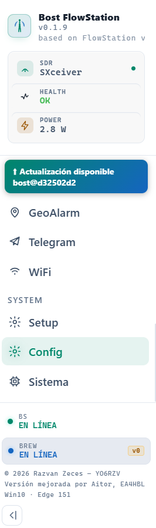
</p>

| Page | Use it for |
|---|---|
| **Radios** | Registered terminals, RSSI, kick / SDS, timeslot view |
| **DGNA** | Assign / deassign talkgroups over the air |
| **Calls / Last Heard / Log** | Live traffic and diagnostics |
| **RF / Health** | Spectrum / constellation and subsystem health |
| **Config** | TMO profiles (sheets), live settings, Cell ISSI whitelist, remote U-STATUS, advanced TOML |
| **System** | Host metrics, service control, OTA, panel account, station backup (`.bptbs`) |
| **Setup** | Re-run first-boot helper anytime |

---

## System control & OTA updates

Restart, suspend, full power-off and OTA live in the **System** hero (top-right actions) — not in Config.

<p align="center">
  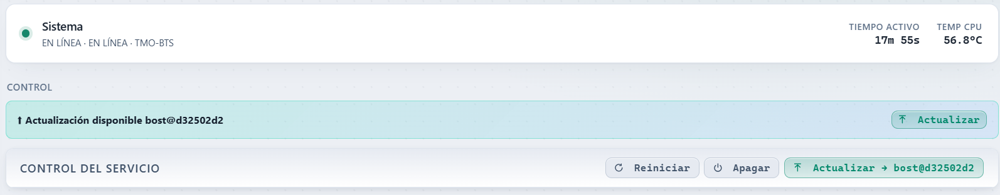
</p>

- **Reiniciar** — soft restart of `bluestation-bs`
- **Suspender** — soft standby: radio stack stops, dashboard stays up; the button becomes **Iniciar** to bring the station back
- **Apagar** — full host shutdown (`systemctl poweroff`); you will likely need to cycle power to boot again
- **Canal OTA** — **Estable** (`bost`, day-to-day) or **Beta** (`beta`, previews); persisted as `[dashboard] ota_channel`
- **Actualizar** — OTA on the selected channel: `git fetch` + `reset --hard` to that branch (keeps `target/` for incremental builds), rebuild only if the running binary is behind, install, restart

When a newer commit is on GitHub for the **active channel**, a banner appears above the System hero and a matching badge shows in the sidebar (click → System).

### Station backup (`.bptbs`) and profile packs (`.ptbs`)

- **System → Backup** — export/import a full station file (`.bptbs`): live `config.toml`, Cell/Brew profiles, setup/fallback siblings, and saved Wi-Fi passwords (NetworkManager). Import replaces the destination station, **keeps** local `[dashboard] ota_channel`, scrapes bad `source_dir` paths, merges Wi-Fi by SSID (does not delete networks absent from the backup), then restarts.
- **Config → TMO profiles** — export/import Cell/Brew profiles only (`.ptbs`). Does **not** change live config or restart; use **Apply & Restart** when you want them on air.

Treat `.bptbs` as sensitive (Wi-Fi PSKs + dashboard credentials inside config).

The OTA dialog is a three-step flow (channel → what's new → progress). Expand **Ver todo** only if you need the full build log:

<p align="center">
  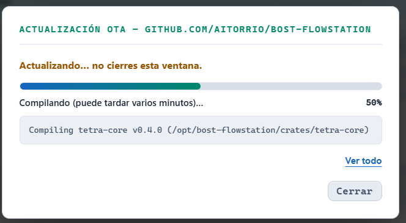
</p>

<p align="center">
  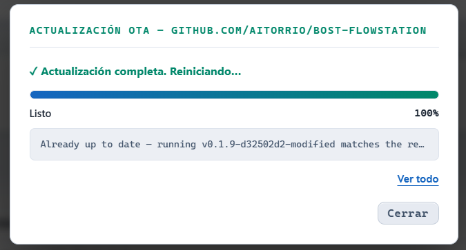
</p>

Compiles on a Pi can take several minutes — leave the window open until it finishes.

### Group call timers (Hangtime / Call timeout)

Under **Config → Advanced network / timers**, **Call timeout** is the maximum length of one group call (ETSI T310-style), not each PTT. Hangtime keeps the same call open between quick turn-taking (including LST / Brew), so a long QSO can hit the default ~120 s ceiling and radios may show PTT denied — raise the value or set **0** (unlimited). Field help (**?**) explains each timer; see [Docs/config-timers.md](Docs/config-timers.md).

### Panel account (login)

Under **System → Account** you manage the single dashboard login (the same `[dashboard]` username/password in `config.toml`) without editing TOML by hand. Station-wide — like U-STATUS, **not** part of Cell/Brew profiles.

<p align="center">
  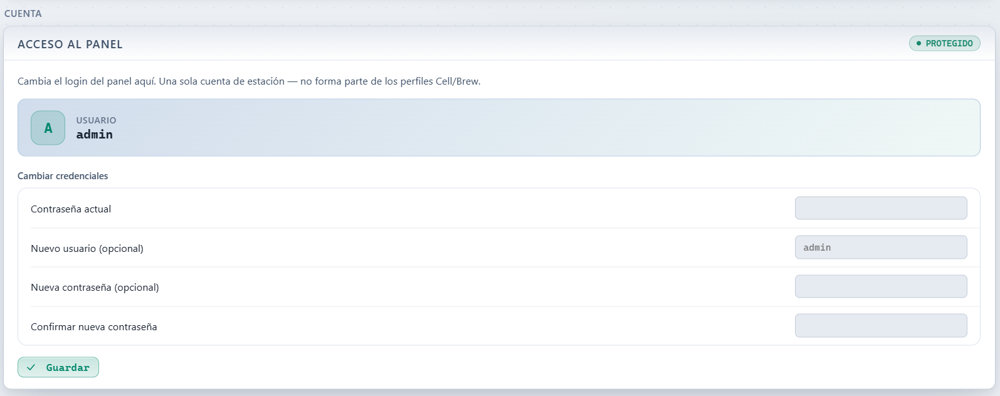
</p>

- Change **username** and/or **password** (current password required).
- If the panel was open (no auth), **enable login** from the same card.
- Changes apply immediately and persist across restart; you are asked to sign in again.

Default after install remains `admin` / `1234` — change it here on first opportunity.

---

## Optional: build from source

Only if you are not using the installer:

```bash
git clone https://github.com/Aitorrio/bost-flowstation.git -b bost
cd bost-flowstation
cp example_config/config.toml ./config.toml
# Prefer phy_io.backend = "None" until RF is configured via Setup / Config
cargo build --release -p bluestation-bs
./target/release/bluestation-bs config.toml
```

---

## Branches

| Branch | Purpose |
|---|---|
| **`bost`** | This fork — install script, Setup, visual config, OTA, Spanish UI |
| `main` | Upstream-aligned mirror — **do not** use for Bost features |
| `alpha` | Upstream active development |

---

## Upstream & community

- **This fork:** [github.com/Aitorrio/bost-flowstation](https://github.com/Aitorrio/bost-flowstation) (branch `main`)
- **Upstream project:** [FlowStation](https://github.com/razvanzeces/flowstation) · [flowstation.dev](https://flowstation.dev) · [Telegram](https://t.me/+fktnT-th7dcxYWNk)

For Asterisk, DAPNET, Snom, GeoAlarm and deep protocol notes, use the upstream docs — this fork inherits those features but documents the **Pi + dashboard** path here.

---

## Credits

- **Razvan Zeces / YO6RZV** and the FlowStation community for the base station stack
- **Mihajlo YU4MSH**, **Torben DJ2TH**, **Joaquin EA5GVK** and others credited upstream
- **MidnightBlueLabs** — [tetra-bluestation](https://github.com/MidnightBlueLabs/tetra-bluestation)
- **Aitor, EA4HBL** — this fork (install, Setup, visual config, OTA UX, Spanish UI)

---

## License

Apache 2.0 — see [LICENSE](LICENSE)
